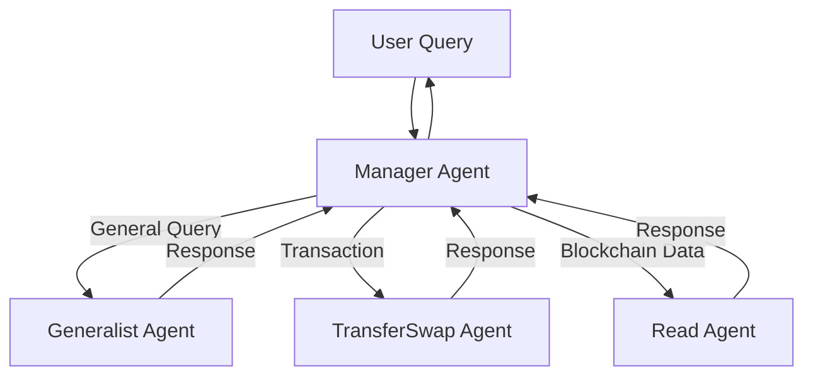

Create a sophisticated multi-agent system using LangGraph and Solana Agent Kit. This implementation enables specialized agents to handle different aspects of Solana operations through a coordinated workflow.

## Architecture Overview



## Specialized Agents

1. **Manager Agent**
   - Query routing
   - Workflow orchestration
   - Response aggregation
   - State management

2. **Generalist Agent**
   - Basic queries
   - General information
   - Tavily search integration
   - Context understanding

3. **TransferSwap Agent**
   - Token transfers
   - Token swaps
   - Transaction management
   - Fee handling

4. **Read Agent**
   - Blockchain queries
   - Balance checks
   - Transaction history
   - Account information

## Quick Start

### 1. Setup Project
```bash
# Clone repository
npm install -g degit
degit sendaifun/solana-agent-kit/tree/docs/examples/agent-kit-langgraph myproject
cd myproject

# Install dependencies
pnpm install

# Configure environment
cp .env.example .env
```

### 2. Environment Configuration
```env
OPENAI_API_KEY=your_openai_key
TAVILY_API_KEY=your_tavily_key
RPC_URL=your_solana_rpc
SOLANA_PRIVATE_KEY=your_wallet_key
```

### 3. Project Structure
```
src/
├── agents/
│   ├── manager.ts
│   ├── general.ts
│   ├── transfer.ts
│   └── read.ts
├── prompts/
│   └── templates/
├── tools/
└── utils/
```

## Implementation

### Agent Configuration
```typescript
// agents/manager.ts
import { StateGraph } from "@langchain/langgraph";

const graph = new StateGraph({
  channels: {
    query: ChannelType.GENERAL,
    blockchain: ChannelType.BLOCKCHAIN,
    transaction: ChannelType.TRANSACTION
  }
});

// Add nodes
graph.addNode("manager", managerAgent);
graph.addNode("general", generalAgent);
graph.addNode("transfer", transferAgent);
graph.addNode("read", readAgent);

// Define edges
graph.addEdge("manager", "general");
graph.addEdge("manager", "transfer");
graph.addEdge("manager", "read");
```

### Specialized Agent Implementation
```typescript
// agents/general.ts
class GeneralistAgent extends BaseAgent {
  async process(input: AgentInput): Promise<AgentOutput> {
    // Implementation using Tavily search
    if (this.config.enableSearch) {
      const searchResults = await this.tavily.search(input.query);
      // Process search results
    }
    
    return {
      response: await this.generateResponse(input, context)
    };
  }
}
```

## Usage Examples

### Basic Query Flow
```typescript
const workflow = new SolanaAgentWorkflow();

// General query
const response = await workflow.run({
  query: "What is the current SOL price?",
  type: QueryType.GENERAL
});

// Transaction query
const transferResponse = await workflow.run({
  query: "Send 1 SOL to address...",
  type: QueryType.TRANSACTION
});
```

### Custom Agent Integration
```typescript
// Add custom agent
const customAgent = new CustomAgent({
  name: "custom",
  description: "Handles custom operations",
  tools: [/* custom tools */]
});

workflow.addAgent(customAgent, {
  triggers: ["custom", "specific"]
});
```

## State Management

### Workflow State
```typescript
interface WorkflowState {
  query: string;
  context: any;
  history: Message[];
  activeAgent: string;
  status: WorkflowStatus;
}

// State updates
graph.onStateChange((state: WorkflowState) => {
  // Handle state changes
});
```

### Channel Types
```typescript
enum ChannelType {
  GENERAL = "general",
  BLOCKCHAIN = "blockchain",
  TRANSACTION = "transaction",
  CUSTOM = "custom"
}
```

## Best Practices

1. **Agent Design**
   - Clear responsibilities
   - Minimal overlap
   - Efficient routing
   - Error handling

2. **State Management**
   - Immutable updates
   - Clear transitions
   - State validation
   - History tracking

3. **Error Handling**
   - Graceful degradation
   - Error recovery
   - State rollback
   - User feedback

## Common Issues

1. **Routing Issues**
   - Ambiguous queries
   - Missing context
   - Circular routing
   - State conflicts

2. **Performance**
   - Response times
   - Resource usage
   - Memory management
   - API limits

3. **Integration**
   - API compatibility
   - Version conflicts
   - Tool availability
   - State synchronization

## Testing

### Unit Tests
```typescript
describe('Manager Agent', () => {
  it('routes general queries correctly', async () => {
    const result = await managerAgent.route({
      query: "What is Solana?",
      type: QueryType.GENERAL
    });
    expect(result.agent).toBe("general");
  });
});
```

### Integration Tests
```typescript
describe('Workflow', () => {
  it('completes full query cycle', async () => {
    const workflow = new SolanaAgentWorkflow();
    const response = await workflow.run({
      query: "Send 1 SOL",
      type: QueryType.TRANSACTION
    });
    expect(response.status).toBe("completed");
  });
});
```

## Development Tips

1. **Local Development**
   - Use mocks
   - Test workflows
   - Monitor state
   - Log transitions

2. **Debugging**
   - State inspection
   - Flow tracking
   - Error logging
   - Performance monitoring

3. **Deployment**
   - Environment setup
   - API configuration
   - Monitoring
   - Scaling

## Resources

- [LangGraph Documentation](https://js.langchain.com/docs/tutorials/graph/)
- [Solana Agent Kit GitHub](https://github.com/sendaifun/solana-agent-kit)
- [Tavily API Docs](https://docs.tavily.com)
- [TypeScript Guidelines](https://www.typescriptlang.org/docs/handbook/intro.html)

## Support

For assistance:
- GitHub Issues
- Documentation
- Community Forums
- Development Team
